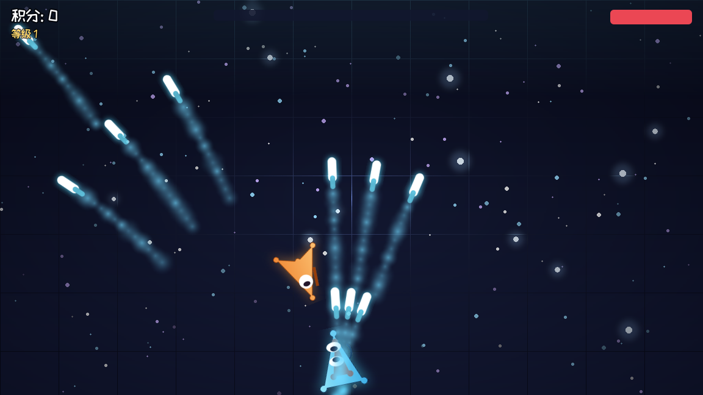
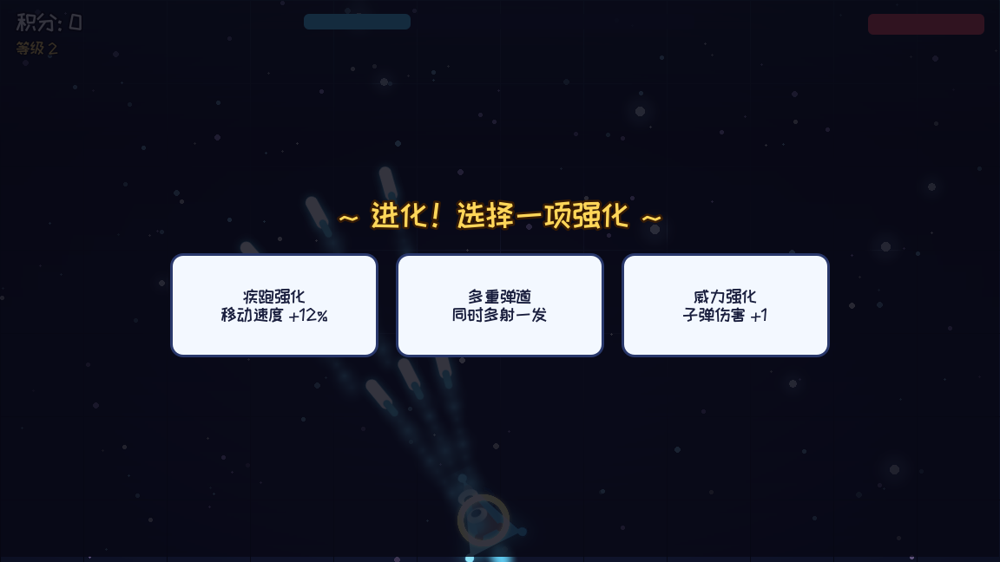

<div align="center">

# No Survivor Game

**A Godot 4 arena-survivor mini game — hold the beach, sweep the landing waves, evolve your build**

[](https://mocas-12.github.io/no-survivor-game/)
[](https://godotengine.org/)
[](https://docs.godotengine.org/en/stable/tutorials/scripting/gdscript/index.html)
[-525252)](https://mocas-12.github.io/no-survivor-game/)

**[🌐 Play in Browser (GitHub Pages)](https://mocas-12.github.io/no-survivor-game/)**

**English** | [简体中文](./README.zh-CN.md)

*WASD to move · aim with the mouse · hold left click to sweep the waves*

 

</div>

---

## 📖 Table of Contents

- [Gameplay](#-gameplay)
- [Enemies](#-enemies)
- [Level-Up: The Evolution Moment](#-level-up-the-evolution-moment)
- [Game Feel](#-game-feel)
- [Tech Highlights](#-tech-highlights)
- [Project Structure](#-project-structure)
- [Quick Start](#-quick-start)
- [FAQ](#-faq)
- [License & Credits](#-license--credits)

## 🎮 Gameplay

Enemies storm in from the top of the screen like a beach landing and chase you down. Destroy them, grab the XP crystals they drop, level up and pick your evolutions — see how long you can hold the line before the swarm takes you down. The spawn rate keeps accelerating with your score, and heavier enemy types join the landing as it goes.

- 🌊 **Beach-defense waves**: enemies land from the top edge and hunt you down
- 💎 **XP crystals**: kills drop glowing gems that magnet toward you
- 🧬 **Level-up with 3-choose-1 upgrades**: every level pauses the game for an evolution pick
- 📈 **Dynamic difficulty**: spawn interval shrinks from 0.9s to 0.3s as your score climbs
- 💀 **Run summary**: game over shows your final score and level, with one-click restart

## 👾 Enemies

| Enemy | Look | HP | Speed | Score | Touch Damage | XP Drop |
| --- | --- | --- | --- | --- | --- | --- |
| Grunt | 😡 red blob | 3 | 150 | 10 | 1 | 1 |
| Dart | 👁️ orange one-eye dart | 1 | 260 | 5 | 1 | 1 |
| Tank | 😬 purple armored hexagon | 12 | 80 | 40 | 3 | 3 |

Tanks join the landing after 150 points, darts after 50 — the higher your score, the more often they show up.

## 🧬 Level-Up: The Evolution Moment

Every level-up freezes time for a full "evolution" beat:

1. ⏸️ the game pauses, a golden flash sweeps the screen
2. 💥 a golden shockwave ring bursts out of your ship while confetti sparks rain down
3. 🛸 your ship pulses bigger with the beat
4. 🎴 a panel springs in with **3 random upgrade cards** — pick one and the fire continue

| Upgrade | Effect |
| --- | --- |
| 🔥 Fire Rate | shooting interval −20% |
| 💪 Power | bullet damage +1 |
| 🎇 Multishot | +1 bullet per volley (up to 7) |
| 👟 Sprint | move speed +12% |
| 🛡️ Armor | max HP +2 and heal 4 |

Upgrades stack — a maxed build sprays a 7-bullet fan of glowing rounds.

## ✨ Game Feel

- 💫 bullets glow with soft trails; every hit bursts into sparks
- 💥 kills explode into color-matched glow puffs + sparks + an expanding shockwave ring
- 📳 camera shake scaled by the kill (tanks shake the screen hard)
- 💎 gems breathe and spin, magnetizing to you when close
- 🌌 deep-space starfield backdrop with a faint sea haze rolling in from the landing zone

## 🧠 Tech Highlights

- 🎮 **Godot 4.7 / GDScript**, GL Compatibility renderer for maximum browser reach
- 🎨 **All art is procedurally generated** by `tools/gen_assets.py` (Python + Pillow) — one cohesive rounded-neon style, regenerable in seconds
- 🀄 **Embedded rounded CJK font** (ZCOOL KuaiLe) so the Chinese UI renders identically in the browser, where system fonts are unavailable
- 🕸️ **Web export with thread support off** — no SharedArrayBuffer / COOP-COEP headers needed, so it runs on GitHub Pages as-is
- ✨ All effects use `CPUParticles2D` + additive-blend sprites: no GPU particles, no shaders, friendly to weak devices

## 📁 Project Structure

```text
no-survivor-game/
├── assets/                # generated art + embedded font
│   ├── fonts/             # ZCOOL KuaiLe (SIL OFL)
│   └── *.png              # player, enemies, bullet, gem, particles, starfield
├── tools/
│   └── gen_assets.py      # regenerates every PNG in assets/ (Python + Pillow)
├── docs/                  # deployed web build (GitHub Pages serves this folder)
├── screenshots/           # README screenshots
├── world.gd / world.tscn  # game state: score, HP, XP, level-ups, all FX helpers
├── player.gd / .tscn      # movement, mouse aim, hold-to-fire, multishot
├── enemy.gd / .tscn       # chase AI, 3 types via setup(), death FX
├── bullet.gd / .tscn      # glowing round + trail + hit sparks
├── gem.gd / .tscn         # XP crystal with magnet pickup
├── camera.gd              # decaying screen shake
├── panel_fx.gd            # scale-in animation for panels
└── export_presets.cfg     # Web preset (threads off)
```

## 🚀 Quick Start

**Play online** — open <https://mocas-12.github.io/no-survivor-game/> and click into the page. First load is ~40 MB (the engine itself), cached by the browser afterwards.

**Run from source**:

```bash
git clone https://github.com/Mocas-12/no-survivor-game.git
# open the folder in Godot 4.7+ and press F5
```

**Rebuild the web version**:

```bash
godot --headless --path . --export-release "Web" build/web/index.html
cp -r build/web/* docs/    # then commit & push to redeploy
```

**Regenerate all art** (optional):

```bash
python tools/gen_assets.py
```

## ❓ FAQ

**Why is the first load slow?**
The 39 MB WebAssembly engine is downloaded once; the browser caches it and later visits start instantly.

**Does it work on phones?**
It loads and runs, but it's tuned for mouse aim + keyboard — desktop is the intended way to play.

**Where are the image files from?**
None are downloaded — every sprite and particle texture is drawn by `tools/gen_assets.py`. Tweak the palette there and rerun to restyle the whole game.

## 📄 License & Credits

- **Code & generated art**: © Mocas-12, all rights reserved
- **Font**: [ZCOOL KuaiLe](https://fonts.google.com/specimen/ZCOOL+KuaiLe) — SIL Open Font License 1.1
- **Engine**: [Godot Engine](https://godotengine.org/) 4.7 — MIT License
