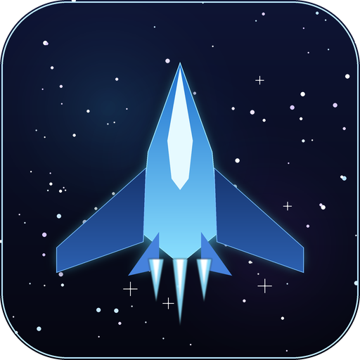

<div align="center">



# No Survivor Game

**A Godot 4 3D vertical-scrolling arena survivor — mouse/touch-piloted fighter, 5-boss fleet, elemental weapons, 20 evolving 3D ship forms**

[](https://mocas-12.github.io/no-survivor-game/)
[](https://godotengine.org/)
[](https://docs.godotengine.org/en/stable/tutorials/scripting/gdscript/index.html)
[](https://mocas-12.github.io/no-survivor-game/)

**[🌐 Play in Browser (GitHub Pages)](https://mocas-12.github.io/no-survivor-game/)**

**English** | [简体中文](./README.zh-CN.md)

*Desktop: move the mouse — the fighter follows and fires automatically · Mobile: left-thumb joystick*

 

</div>

---

## 📖 Table of Contents

- [Gameplay](#-gameplay)
- [Enemy Fleet](#-enemy-fleet)
- [Boss Fleet](#-boss-fleet)
- [Ship Forms](#-ship-forms)
- [Upgrades: Elements & Patterns](#-upgrades-elements--patterns)
- [Game Feel](#-game-feel)
- [Tech Highlights](#-tech-highlights)
- [Project Structure](#-project-structure)
- [Quick Start](#-quick-start)
- [FAQ](#-faq)
- [License & Credits](#-license--credits)

## 🎮 Gameplay

Pilot your fighter by mouse on desktop or a virtual joystick on touch screens — guns fire automatically, so all you do is dodge. Enemy squadrons storm in from the top like a beach landing, gunships shoot back, and every few waves a siren announces a boss warship with its own bullet patterns. Grab XP crystals, evolve your ship, and hold the line.

- 🖱️ **Desktop**: mouse piloting with full-auto fire — focus on dodging
- 📱 **Mobile**: touch anywhere on the left half to summon a movement joystick
- ⏸️ **Pause anywhere**: Esc or the on-screen button — resume, restart, mute, or turn on reduced-flash mode
- 🏆 **Best score persists**: saved to localStorage on the web (a file on desktop); beat it and the game cheers
- 🔤 **Bilingual UI**: every label, card and banner auto-switches between 中文 and English by system language
- 🌊 **Beach-defense waves**: 6 enemy types land from the top edge, plus formation assaults — V-formations, shield walls and twin-flank pincers
- 💎 **XP crystals**: kills drop glowing gems that drift with the starfield and magnet toward you
- 👑 **Boss battles**: every wave triggers a sirened 1v1 duel — normal spawns slow to a trickle until it falls
- 🛩️ **Ship evolution**: bosses drop power cores that transform your fighter (with a full cinematic) — a missed core hovers at the bottom edge instead of vanishing
- 📈 **Dynamic difficulty**: spawn interval shrinks from 0.9s to 0.3s as your score climbs, and enemies toughen with every boss wave
- 💚 **Out-of-combat repair**: after 4s without taking damage, the hull slowly self-repairs
- ✦ **Form abilities**: every transformation grants a rotating special power — gravity nova, overcharge, frost/flame auras, magnet core, nano-repair, phase shield, thrust, bullet storm, gravity well; while active, the ship carries a themed aura (orbiting frost snowflakes / radius rings / shield bubble), the HUD indicator stays on, and timed buffs show a countdown bar
- 💀 **A cinematic death**: exploding in slow motion before the results screen — unless you carry a Phoenix Core, which revives you with a screen-clearing shockwave

## 👾 Enemy Fleet

| Enemy | Look | HP | Speed | Score | Touch Damage | XP | Special |
| --- | --- | --- | --- | --- | --- | --- | --- |
| Grunt | red strike fighter | 3 | 150 | 10 | 1 | 1 ⚪ | — |
| Dart | orange one-eye interceptor | 1 | 260 | 5 | 1 | 1 ⚪ | periodic dash bursts |
| Swift | green micro-fighter | 1 | 300 | 8 | 1 | 1 ⚪ | serpentine weaving |
| Shooter | blue-gray gunship | 4 | 110 | 15 | 1 | 3 🟢 | hovers in the upper half and fires |
| Guard | silver armored wedge | 8 | 80 | 25 | 2 | 3 🟢 | slow lateral patrol |
| Tank | purple heavy battleship | 12 | 80 | 40 | 3 | 8 🟣 | stop-and-go advance |

**XP gems come in three tiers** dropped by enemy HP: ⚪ white (small) 1 XP · 🟢 green (medium) 3 XP · 🟣 purple (large) 8 XP — the tougher the foe, the bigger and richer the crystal.

New types join the landing as your score grows (Swift at 20, Dart at 40, Shooter at 60, Guard at 100, Tank at 150). Every boss wave defeated hardens the whole fleet (compounding ×1.15 HP per wave, keeping pace with your firepower), and every ~15s a formation assault sweeps in: V-shaped swift squadrons, slow shield walls, or pincers converging from both flanks.

## 👑 Boss Fleet

When the kill counter crosses the threshold an alarm sounds, spawns slow to a trickle, and a boss warship enters with its own HP bar. Five bosses rotate, and every later encounter has more HP and harder-hitting bullets:

| Boss | Look | Signature Skill |
| --- | --- | --- |
| 🔴 **Destructor** | triple-hull red battleship | rotating 14-shot ring barrages |
| 🟣 **Interceptor** | twin-prong stealth cruiser | player-seeking 5-shot fans + slow rings |
| 🟢 **Fortress** | teal mega-carrier | triple rotating spiral streams |
| 🟡 **Hunter** | gold twin-claw stalker | homing rounds + 6-way shots |
| 🔵 **Phantom** | blue crystal ghost | teleports, then bursts 8-spike volleys |

Every boss fires its own signature rounds — the bullet is the identity: Destructor's **crimson heavy shells**, Interceptor's **violet darts**, Fortress's **emerald lance bolts**, Hunter's **gold stingers** (with a faint trail), Phantom's **cyan crystal shards**. When a boss enrages, each shows its own signature effect: Destructor's red turret orbs orbiting, Interceptor's violet exhaust streaks, Fortress's four charging nodes, Hunter's golden crackle, Phantom's rising blue wisps, and OMEGA's five-colored fleet orbs.

From the second cycle (wave 6) onward each boss also carries a random **affix** (shown next to its name) — **Swift** (+25% bullet speed), **Fortified** (+50% HP), **Summoner** (calls minions), **Vengeful** (detonates a bullet ring on death).

After two full cycles (10 waves) of the five bosses, the final **OMEGA mothership** descends — it has devoured the entire fleet: it rotates through all five signature bullet styles, enrages at 70% HP, and below 35% it gains Phantom's teleport plus full-screen destructor rings. Bringing it down triggers the **victory settlement** — a run recap, a permanently saved badge and the endless / restart choice — after which endless mode continues for a higher score.

Defeating a boss chains explosions across the screen and drops a **power core** — catch it to transform your fighter; even if you let it drift to the bottom it hovers there until you come get it. At half HP bosses **enrage**: faster fire, faster bullets and expanded patterns.

## 🛩️ Ship Forms

**20 progressive forms across 5 tiers** — every power core evolves the fighter one step with a visible silhouette change (wider wings, new wing geometry, more engines, wingtip cannons, armor plating):

| Tier | Forms | Wing family | Extras |
| --- | --- | --- | --- |
| Scout | 1-4 | delta wings | 1-2 engines |
| Assault | 5-8 | swept wings | wing pods |
| Heavy | 9-12 | wide wings | gun barrels |
| Flagship | 13-16 | X-wings | armor plating |
| Sovereign | 17-20 | twin prongs | everything + max size |

Each core also grants a permanent stat bump (extra volley guns, damage, fire rate, hull). The transformation plays **without pausing the fight**: the old hull contracts into white light, a beam erupts skyward and the new frame elastic-pops in while you keep flying.

## 🧬 Upgrades: Elements & Patterns

Each level-up pauses the game and deals **3 random cards out of a 19-card pool**. Every card stacks — basics, elemental warheads and the wave pattern all level up to Lv.3 when re-picked, and picking a different element/pattern simply switches to it; each keeps its own level, and switch picks are labeled on the card:

| Card | Effect |
| --- | --- |
| 🔥 Fire Rate | shooting interval −20% (stackable) |
| 💪 Power | bullet damage +1 (stackable) |
| 🎇 Multishot | +1 bullet per volley (up to 7) |
| 👟 Sprint | move speed +12% (up to Lv.5) |
| 🛡️ Armor | max HP +2 and heal 4 (stackable) |
| 🔴 Fire warhead | bullets splash to nearby enemies, damage +1 |
| 💧 Water warhead | knocks foes back and soaks them, triggers reactions |
| 🔵 Ice warhead | hits slow enemies by 45% for 1.6s |
| 🟣 Lightning warhead | hits chain to up to 2 nearby enemies |
| 🟢 Wind warhead | bullet speed +40%, gathers nearby foes into one spot |
| 🌠 Wide barrage | wider fan, +1 bullet |
| 〰️ Wave path | bullets snake sideways for wider coverage |
| 🧲 Magnet | gem pickup range +35% (up to Lv.3) |
| 🎓 Elite Pilot | XP gain +15% (up to Lv.3) |
| 🐦‍🔥 Phoenix Core | revive once on death with a screen-clearing shockwave |
| ✨ Critical | 10% chance for double damage (up to Lv.3) |
| 🚀 Velocity | projectile speed +20% (up to Lv.3) |
| ⚡ Chain Reaction | reaction damage +50%, wider area (up to Lv.2) |
| ⏳ Element Extend | element marks last +1s (up to Lv.2) |

**Elemental reactions** (the first hit leaves a mark, the second triggers and consumes it — the reaction name floats up at the impact point):

| Reaction | Combo | Effect |
| --- | --- | --- |
| Steam | Fire + Water | white vapor burst, burns nearby foes |
| Overload | Storm + Fire | orange blast, heavy area damage |
| Freeze | Ice + Water | target nearly frozen for 1.2s |
| Conduct | Storm + Water | chains to 2 extra targets |
| Firestorm | Wind + Fire | spiraling fire pillar, double shockwave |
| Tornado | Wind + Water | cyan vortex pulls foes in |
| Melt | Fire + chilled | 200% single-target burst |
| Tempest | Storm + Wind | three lightning strikes around the target |

**Homing missiles are an item, not a card**: every boss killed grants one charge — click the mouse (or the bottom-right button on mobile) to trigger it: **every player bullet on screen turns into a homing round** (gilded, with a golden flash and a transform sfx). If no bullets are on screen, the charge is not consumed. You can pivot between elements anytime without losing levels. If the whole pool maxes out, a Field Repair filler card keeps level-ups meaningful.

## ✨ Game Feel

- 🌌 four-layer parallax starfield (nebula → far → mid → near) scrolling toward you for constant motion
- 🎵 fully synthesized driving BGM — a 140-BPM loop with drum grooves, saw bass, power chords, arpeggios and a heroic lead melody
- 🔊 synthesized SFX for every action: laser fire, hits, explosions, pickups, level-up chime, boss siren, transformation sweep
- 💫 bullets glow with element-colored trails; hits burst into sparks
- 💥 kills explode into color-matched glow puffs + sparks + an expanding shockwave ring; bosses chain-detonate
- 📳 camera shake scaled by the event (bosses shake the screen hard)
- 🩸 0.35s invulnerability window after taking damage, with red damage flash

## 🧠 Tech Highlights

- 🎮 **Godot 4 / GDScript**, GL Compatibility renderer for maximum browser reach
- 🎨 **Generated backgrounds & touch UI** by `tools/gen_assets.py` (Python + Pillow); ships, bosses and effects are fully 3D
- 🔈 **All audio is procedurally synthesized** by `tools/gen_sounds.py` (pure math → WAV) — SFX and the looping BGM, zero audio assets shipped
- 🌐 **Zero-allocation bullets**: player bullets live in an object pool with element materials/meshes shared statically, so max-fire-rate spraying doesn't churn memory on weak devices
- 🀄 **Embedded rounded CJK font** (ZCOOL KuaiLe) so the Chinese UI renders identically in the browser
- 🕸️ **Web export with thread support off** — no SharedArrayBuffer / COOP-COEP headers needed, runs on GitHub Pages as-is
- 📱 **Touch-first mobile support**: a virtual joystick appears automatically on touch devices; pause and settings are thumb-reachable
- 💾 **Tiny save layer**: best score and settings persist to `localStorage` on the web or `user://save.json` on desktop
- 🧠 **Handcrafted low-poly 3D fleet**: 20 player forms, 6 enemies and 5 bosses use CC0 models from Quaternius' Ultimate Spaceships pack, normalized and liveried at runtime by `model_builder.gd` — perspective camera, directional + ambient lighting, WorldEnvironment glow, and `CPUParticles3D` / emissive-material effects stay friendly to weak devices

## 📁 Project Structure

```text
no-survivor-game/
├── assets/                # art & audio resources
│   ├── fonts/             # ZCOOL KuaiLe (SIL OFL)
│   ├── ships/             # low-poly ship models & liveries (Quaternius, CC0)
│   ├── sounds/            # synthesized SFX + looping BGM (tools/gen_sounds.py)
│   └── *.png              # parallax starfield + touch joystick + snowflake (gen_assets.py)
├── scenes/                # 9 scenes: world / player / enemies / bosses / bullets / core / gem
├── scripts/               # all game logic (20 scripts)
│   ├── world.gd           # state hub: UI / audio / save / pause / settlement
│   ├── spawn_director.gd  # spawning / formations / boss scheduling (static module)
│   ├── form_ability.gd    # morph cinematic / form powers / auras (static module)
│   ├── player.gd          # mouse/touch piloting, elements & patterns, 20 forms, death/revive
│   ├── enemy.gd           # 6 enemy types, signature movement, boss-wave scaling
│   ├── boss.gd            # 6 bosses (incl. final OMEGA), cycle affixes, signature enrage FX
│   ├── bullet.gd          # player bullets: object pool + 8 elemental reactions
│   ├── enemy_bullet.gd    # enemy rounds: per-source bullet styles
│   ├── upgrades.gd        # 19-card upgrade pool (ids / conditions / effects)
│   ├── i18n.gd            # zh/en string table, auto-picked by system locale
│   ├── save.gd            # best score & settings (web localStorage / desktop file)
│   ├── fx.gd              # one-shot VFX library: shockwave rings, explosions, confetti, lightning
│   ├── model_builder.gd   # ship model loading + normal smoothing (Quaternius CC0 fleet)
│   └── …                  # camera / touch_ui / panel_fx / pause_menu / gem / core / hit_spk
├── tools/                 # dev tools: art/audio generators + headless smoke & balance tests + capture
├── docs/                  # deployed web build (GitHub Pages serves this folder)
├── screenshots/           # README screenshots
├── project.godot          # Godot project config (main scene / renderer / embedded font)
└── export_presets.cfg     # Web preset (threads off)
```

## 🚀 Quick Start

**Play online** — open <https://mocas-12.github.io/no-survivor-game/>. First load is ~40 MB (the engine itself), cached by the browser afterwards.

**Run from source**:

```bash
git clone https://github.com/Mocas-12/no-survivor-game.git
# open the folder in Godot 4.7+ and press F5
```

**Rebuild the web version**:

```bash
godot --headless --path . --export-release "Web" build/web/index.html
cp -r build/web/* docs/    # then commit & push to redeploy
```

**Regenerate all art / audio** (optional):

```bash
python tools/gen_assets.py
python tools/gen_sounds.py
```

## ❓ FAQ

**Why is the first load slow?**
The 39 MB WebAssembly engine is downloaded once; the browser caches it and later visits start instantly.

**Can I play on a phone?**
Yes — touch the left half of the screen to summon the movement joystick; the fighter fires automatically. Desktop with a mouse is still the most precise way to play.

**Where are the image / audio files from?**
Nothing is downloaded — the sounds and BGM are synthesized by `tools/gen_sounds.py`, the starfield and joystick textures by `tools/gen_assets.py`, and the ships are CC0 3D models from Quaternius recolored at runtime.

## 📄 License & Credits

- **Code & generated art/audio**: © Mocas-12, all rights reserved
- **Ship models**: [Quaternius — Ultimate Spaceships](https://quaternius.com) — CC0 1.0 (public domain)
- **Font**: [ZCOOL KuaiLe](https://fonts.google.com/specimen/ZCOOL+KuaiLe) — SIL Open Font License 1.1
- **Engine**: [Godot Engine](https://godotengine.org/) 4.7 — MIT License
