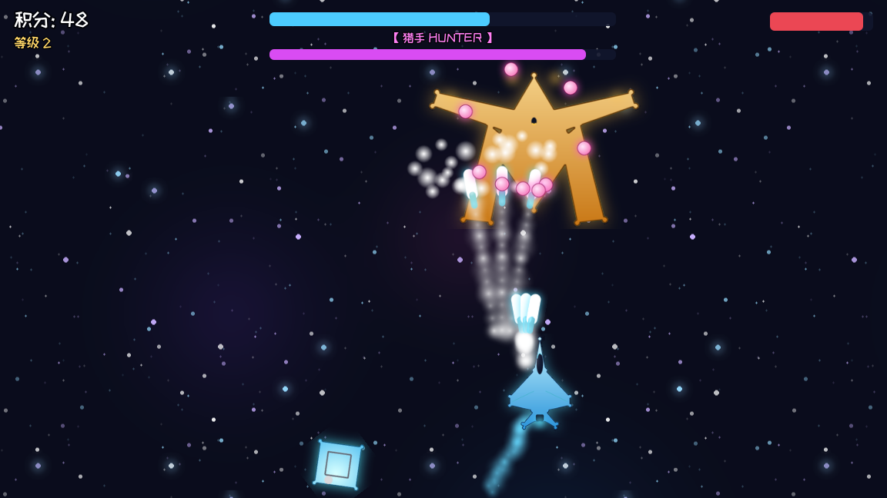

<div align="center">

# No Survivor Game

**Godot 4 纵向弹幕生存游戏 —— 鼠标/触屏驾驶战机、五大 Boss 舰队、元素武器、形态进化**

[](https://mocas-12.github.io/no-survivor-game/)
[](https://godotengine.org/)
[](https://docs.godotengine.org/en/stable/tutorials/scripting/gdscript/index.html)
[](https://mocas-12.github.io/no-survivor-game/)

**[🌐 在线游玩（GitHub Pages）](https://mocas-12.github.io/no-survivor-game/)**

[English](./README.md) | **简体中文**

*桌面：移动鼠标驾驶战机 · 按住左键射击 ｜ 手机：左手摇杆移动 · 右手开火*

 

</div>

---

## 📖 目录

- [玩法](#-玩法)
- [敌机图鉴](#-敌机图鉴)
- [Boss 舰队](#-boss-舰队)
- [战机形态](#-战机形态)
- [升级系统：元素与弹道](#-升级系统元素与弹道)
- [打击感](#-打击感)
- [技术亮点](#-技术亮点)
- [项目结构](#-项目结构)
- [快速开始](#-快速开始)
- [常见问题](#-常见问题)
- [协议与致谢](#-协议与致谢)

## 🎮 玩法

桌面端用鼠标驾驶战机（指哪飞哪、火力朝上），手机端左半屏呼出虚拟摇杆、右侧按钮开火。敌机编队像抢滩登陆一样从屏幕上方涌来，炮手机还会朝你开火；每打掉若干波便响起警报，一艘带专属弹幕的 Boss 巨舰独自登场。击杀、拾取水晶、进化战机，看你能守住多久。

- 🖱️ **桌面端**：鼠标驾驶 + 按住左键连射
- 📱 **手机端**：左半屏触摸呼出摇杆移动，右侧常驻开火按钮
- 🌊 **抢滩登陆波次**：6 种敌机从屏幕上缘登陆
- 💎 **经验水晶**：击杀掉落发光水晶，随星空下漂、靠近磁吸
- 👑 **Boss 战**：警报响起后 Boss 携专属血条独自登场（期间停止刷小怪）
- 🛩️ **战机进化**：Boss 掉落核心装备，接住即触发全套变形演出
- 📈 **动态难度**：刷怪间隔随积分从 0.9 秒一路压缩到 0.3 秒

## 👾 敌机图鉴

| 敌机 | 长相 | 血量 | 速度 | 积分 | 撞击伤害 | 经验 | 特长 |
| --- | --- | --- | --- | --- | --- | --- | --- |
| 普通机 | 红色攻击机 | 3 | 150 | 10 | 1 | 1 | — |
| 快速机 | 橙色单眼拦截机 | 1 | 260 | 5 | 1 | 1 | — |
| 疾风机 | 黄绿微型战机 | 1 | 300 | 8 | 1 | 1 | 蛇形走位 |
| 炮手机 | 蓝灰炮艇 | 4 | 110 | 15 | 1 | 2 | 会朝玩家开火 |
| 盾机 | 银色装甲楔 | 8 | 80 | 25 | 2 | 2 | — |
| 重装机 | 紫色重型战列 | 12 | 80 | 40 | 3 | 3 | — |

积分达到 20 / 40 / 60 / 100 / 150 时，疾风机、快速机、炮手机、盾机、重装机陆续登场。

## 👑 Boss 舰队

击杀数越过阈值后，警报响起、小怪停刷，Boss 巨舰带着专属血条入场。五种 Boss 轮番上阵，越往后血越厚、弹越痛：

| Boss | 长相 | 专属技能 |
| --- | --- | --- |
| 🔴 **毁灭者** | 三舰体红色战列舰 | 旋转 14 连环形弹幕 |
| 🟣 **拦截者** | 双叉隐形巡洋舰 | 追踪玩家的 5 连扇形弹 + 慢速环 |
| 🟢 **要塞** | 青绿巨型航母 | 三向旋转螺旋弹幕 |
| 🟡 **猎手** | 金色双爪追猎舰 | 追踪弹 + 六向直弹 |
| 🔵 **幻影** | 蓝白水晶幽灵舰 | 瞬移闪现 + 八向刺弹 |

击破 Boss 触发连环爆炸，并掉落一枚**核心装备**——在它飘出屏幕前接住，战机立即变形。

## 🛩️ 战机形态

| 形态 | 获取方式 | 外观 | 加成 |
| --- | --- | --- | --- |
| **隼击** | 初始 | 青色三角战机 | 3 连弹道 |
| **先锋** | 第 1 枚核心 | 翼尖挂舱橙色涂装 | 弹道 +1 |
| **堡垒** | 第 2 枚核心 | 青绿重型炮艇 | 伤害 +2，生命上限 +4（回 4） |
| **新星** | 第 3 枚核心 | 品红前掠翼 X 战机 | 弹道 +1，射速 −25%，速度 +10% |

变形是全套渐进演出：时间冻结 → 旧机身收缩白化 → 光柱冲天 → 新机身弹性放大 → 三重冲击波。新星形态后再吃核心会"超载"：伤害 +2、完全回血、射速再提升。

## 🧬 升级系统：元素与弹道

每次升级暂停游戏，从 **12 张卡池随机抽 3 张**——基础强化、元素弹头、弹道模式自由搭配：

| 卡牌 | 效果 |
| --- | --- |
| 🔥 射速强化 | 射击间隔 −20% |
| 💪 威力强化 | 子弹伤害 +1 |
| 🎇 多重弹道 | 每轮齐射多一发（最多 7 发） |
| 👟 疾跑强化 | 移动速度 +12% |
| 🛡️ 装甲强化 | 生命上限 +2 并回复 4 点 |
| 🔴 火焰弹头 | 火元素：命中溅射邻近敌机，伤害 +1 |
| 🔵 寒冰弹头 | 冰元素：命中减速敌机 45%，持续 1.6 秒 |
| 🟣 雷电弹头 | 雷元素：链式电击最多 2 个邻近目标 |
| 🟢 疾风弹头 | 风元素：弹速 +40%，命中击退 |
| 🎯 精准直射 | 弹道平行集中，射速 +25% |
| 🌠 扩散弹幕 | 扇形张开，弹道 +1 |
| 〰️ 波浪弹道 | 子弹蛇行，覆盖更广 |

元素流派：火烧密集阵、雷点分散兵、冰风筝追兵、风推走位。

## ✨ 打击感

- 🌌 四层视差星空（星云→远→中→近）持续向你流动，随时都有"在飞"的感觉
- 🎵 程序化合成的循环 BGM：贝斯 + 和弦垫 + 琶音 + 鼓点，全靠脚本生成
- 🔊 全动作合成音效：激光、命中、爆炸、拾取、升级音阶、Boss 警报、变身滑音
- 💫 子弹按元素变色发光拖尾，命中迸出火花
- 💥 击杀爆炸：同色光雾 + 火花 + 扩散冲击波圆环；Boss 死亡连环殉爆
- 📳 镜头震动按事件分量缩放（Boss 震得更狠）
- 🩸 受伤后 0.35 秒无敌帧 + 红闪反馈

## 🧠 技术亮点

- 🎮 **Godot 4.7 / GDScript**，GL Compatibility 渲染器，浏览器兼容性拉满
- 🎨 **全部美术程序化生成**：`tools/gen_assets.py`（Python + Pillow）——战机、Boss、特效贴图、视差星空、触屏 UI 一个风格体系
- 🔈 **全部音频程序化合成**：`tools/gen_sounds.py`（纯数学 → WAV）——音效与循环 BGM，零音频素材
- 🀄 **内嵌圆体中文字体**（站酷快乐体）：浏览器里没有系统字体，不内嵌中文全是方块
- 🕸️ **Web 导出关闭线程支持**：不需要 SharedArrayBuffer / COOP-COEP 响应头，GitHub Pages 直接可跑
- 📱 **触屏优先适配**：检测到触屏设备自动显示虚拟摇杆与开火按钮
- ✨ 特效全部使用 `CPUParticles2D` + 加法混合贴图：不依赖 GPU 粒子和着色器，弱设备也流畅

## 📁 项目结构

```text
no-survivor-game/
├── assets/
│   ├── fonts/             # 站酷快乐体（SIL OFL 协议）
│   ├── sounds/            # 合成音效 + 循环 BGM（tools/gen_sounds.py）
│   └── *.png              # 战机、Boss、子弹、水晶、粒子、星空层、触屏 UI
├── tools/
│   ├── gen_assets.py      # 重新生成 assets/ 里所有 PNG（Python + Pillow）
│   └── gen_sounds.py      # 重新生成 assets/sounds/ 里所有 WAV
├── docs/                  # 已部署的网页版（GitHub Pages 指向这里）
├── screenshots/           # README 截图
├── world.gd / .tscn       # 游戏状态、波次/Boss 调度、音效/BGM 管理、特效工具
├── player.gd / .tscn      # 鼠标/触屏驾驶、元素与弹道系统、4 形态
├── enemy.gd / .tscn       # 6 种敌机、减速/击退状态、炮手机 AI
├── boss.gd / .tscn        # 5 种 Boss 弹幕、血条信号、连环殉爆
├── enemy_bullet.gd / .tscn# Boss 弹幕（直线 + 追踪）
├── bullet.gd / .tscn      # 元素子弹（溅射/减速/链电/击退）
├── core.gd / .tscn        # Boss 掉落的核心装备（拾取变形）
├── gem / hit_spk          # 经验水晶、命中火花
├── touch_ui.gd            # 手机虚拟摇杆 + 开火按钮
├── camera.gd              # 衰减式屏幕震动
├── bg_scroll.gd           # 视差滚动星空
└── export_presets.cfg     # Web 导出预设（线程关闭）
```

## 🚀 快速开始

**在线游玩**：打开 <https://mocas-12.github.io/no-survivor-game/>，首次加载约 40 MB（引擎本体），之后浏览器缓存秒开。

**本地运行**：

```bash
git clone https://github.com/Mocas-12/no-survivor-game.git
# 用 Godot 4.7+ 打开该文件夹，按 F5 运行
```

**重新构建网页版**：

```bash
godot --headless --path . --export-release "Web" build/web/index.html
cp -r build/web/* docs/    # 提交推送后自动重新部署
```

**重新生成美术 / 音频**（可选）：

```bash
python tools/gen_assets.py
python tools/gen_sounds.py
```

## ❓ 常见问题

**首次加载为什么慢？**
39 MB 的 WebAssembly 引擎只需下载一次，浏览器缓存后第二次起秒开。

**手机上能玩吗？**
能——触摸屏幕左半边呼出移动摇杆，按住右侧按钮开火。桌面端鼠标操作依然最精准。

**图片 / 音频是哪来的？**
没有任何下载素材——所有贴图、音效和 BGM 都由 `tools/` 里两个脚本程序化生成。改改配色或合成参数重新运行，整个游戏的声画就换掉了。

## 📄 协议与致谢

- **代码与生成美术 / 音频**：© Mocas-12，保留所有权利
- **字体**：[站酷快乐体](https://fonts.google.com/specimen/ZCOOL+KuaiLe) — SIL Open Font License 1.1
- **引擎**：[Godot Engine](https://godotengine.org/) 4.7 — MIT License
